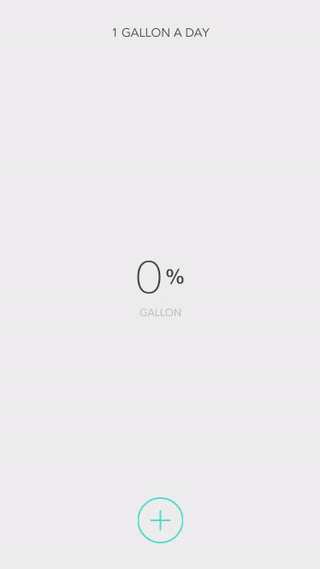
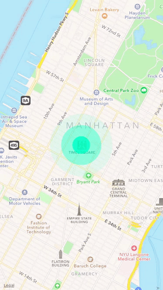
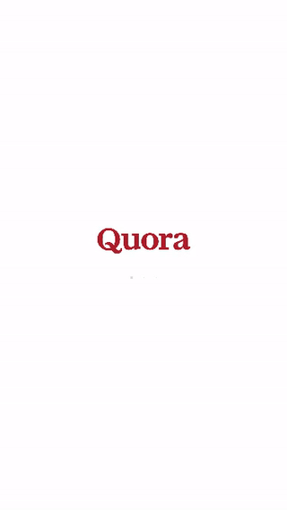
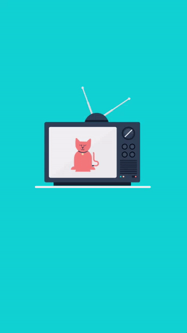

# MSShow
只是一些小Demo合集(Objective-C & Swift)

## 效果图

### 渐变圆弧进度动画(ProgressAnimation)

### 地图定位动画(MapLocationAnimation)

### 文字特效

### 加载动画(LoadingDotsAnimation)

### 播放Gif动图

### 聚光灯效果用户引导

### 搜索动画

### 仿KEEP应用引导页

### 3DTouch
